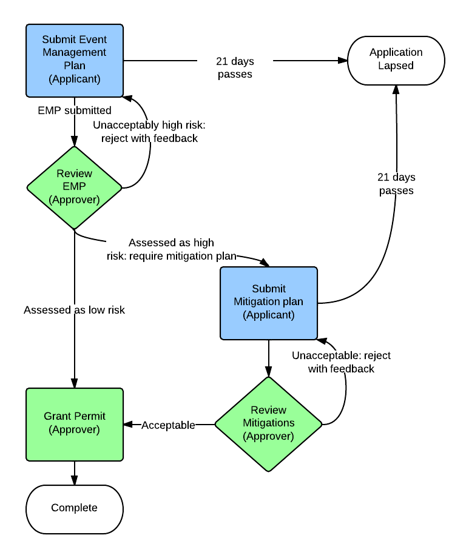
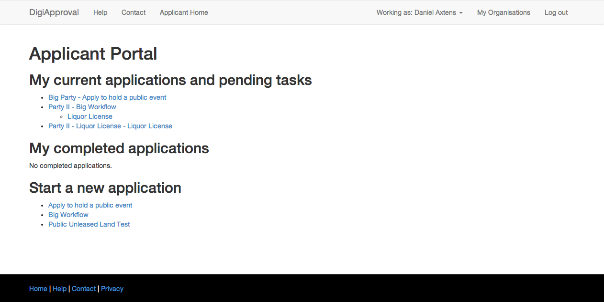
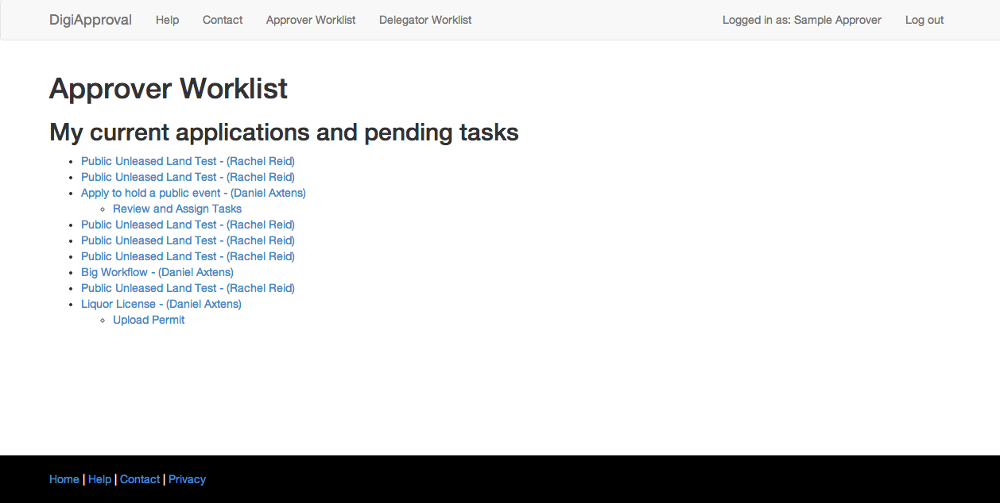
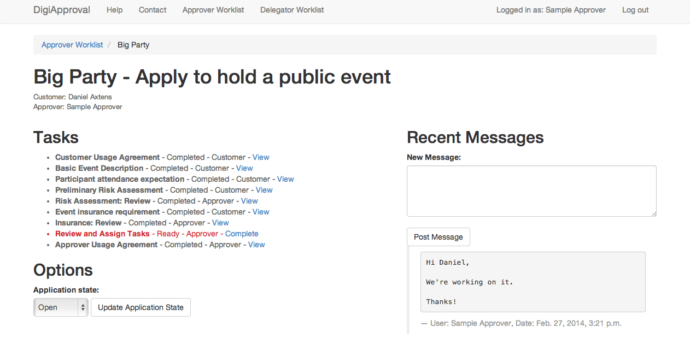
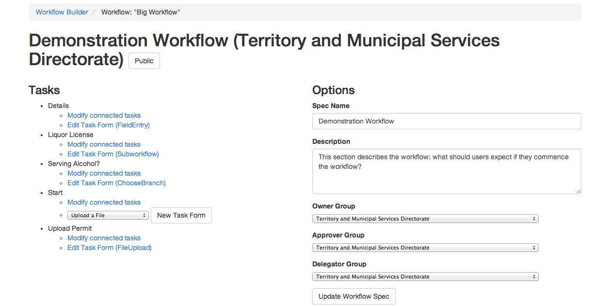
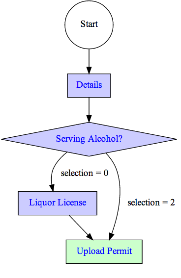

# Digital Canberra Challenge: Round 1 - Case Study
## DigiACTive Pty Ltd, March 2014

# Executive Summary

# Description of challenge
(**What was in the scope?**)

A thriving, vibrant city should make it easy for citizens and small businesses to run public events. At the same time, regulations and permit systems are needed to make sure that events are run in a safe, community-friendly and sustainable way.

Unfortunately, the proliferation of regulations and permits has made running events into something more akin to navigating a maze. We set out to provide Canberrans with a simple, efficient way to navigate that maze.

## Our solution: a birds-eye view
Our proof-of-concept demonstrates a system to that:
 + provides residents and businesses with a clear, streamlined way to work through the various approvals they require.
 + provides a central point of contact so that, as far as possible, a single public servant sees the process through from start to finish and is able to help resolve problems as they come up.
 + lays out the requirements clearly, helping directorates to ensure that applicants understand what is required of them and can meet those requirements with a minimum of fuss.

Our solution is browser-based application built on the concept of modelling approval processes as **workflows**. A workflow is a series of steps with a desired end point. Each step contains certain actions that need to be completed, either by a client or by directorate staff.

> For example, a workflow could be:
+ Apply to use public unleased land
+ Apply for a liquor license
>
> Workflow steps could be:
 + "Enter event details". Completed by a customer, by filling out an online form. The step would lay out what questions are mandatory and which are optional, and provide tips and a way to ask for advice.
 + "Upload a risk management plan". Completed by a customer, by uploading a document. The step lays out the requirements for a risk managment plan, and provides a link to a template and the information that the document must include.
 + "Review risk management plan". Completed by an approver within a directorate, after reviewing a risk assessment plan. The step lays out the internal procedures for assessing these documents, so that there is consistency within the Directorate.

(put this in a box)

The system has been designed around the needs of regular citizens, community groups, businesses and Directorates:
 * Citizens are provided with an interface allowing new applications to be lodged, pending applications continued and completed applications reviewed.
 * Community groups and businesses are provided with powerful tools to maintain the integrity of their accounts and data as their membership changes.
 * Within directorates:
  + Approvers are tasked with reviewing applications
  + Delegators manage the workload of approvers, delegating the processing of customers' applications to various approvers within their area.
  + Administrators are able to modify existing workflows and implement new workflows in a point and click manner.

The system provides flexibility for modifying workflows to adapt to changing business rules and processes, improving consistency in the review and assessment process. The system can act as a **one-stop  shop** for permit applications for both customers and directorates.

## Key Details

| Competition  | [Digital Canberra Challenge][dcc] Round 1  |
|--|--|
| Challenge | **Quicker event approvals**: Improve the process for gaining permits for music & other cultural events in the ACT. |
| Involved Parties | DigiACTive Pty Ltd, eGov Cluster (NICTA), ACT government|
| ACT Government Involvement | Parks and City Services, TAMS |
| Timeframe | ?? 1 November 2013 - 17 March 2014 |
| Budget | $5000 for reimbursement of expenses |
| Deliverables | Proof of Concept System, this Case Study
| Contacts | DigiACTive: Daniel Axtens at [daniel@axtens.net](mailto:daniel@axtens.net)

Due to the limited time-frame of the competiton, the scope of the proof of concept system was tightly restricted. <<moar>>

[dcc]: http://digitalcanberrachallenge.com.au

# Methodology
**How did the team address the challenge?** (NB: this is not the same as the proposed solution. It's asking ... how we got there?)

DigiACTive tackled the challenge over the 2013-14 summer.

## Forming the team and the concept
We first became aware of the challenge as individuals in late 2013. The challenge was discussed socially amongst the ANU's Computer Science Students' Association, and from that a loose, unnamed group was formed.

We initialy approached the technical side of things in general terms:
 + We firstly settled on the idea of a workflow engine, after briefly toying with an enhanced Smart Forms system and a Finite State Machine solution.
 + Because we had existing expertise in development in the team, we built an open source stack around technologies we already knew and trusted.
 + Due to the short time frame of the competition, we verified that the bulk of the project could be built by composing existing open source components.

Once we satisfied ourselves that we could deliver, we proceeded to pitch our concept.

## Pitching the team's solution

The requirement to write a formal pitch was helpful in forcing us to do a more formal sort of design that we might otherwise have done. We had to consider scalability (although we perhaps understood it in a different, more technical, way to what the was expected) and sustainability, which lead us to do more careful design and planning. This up-front design stood us in good stead for implementation.

Having submitted the written pitch, we were somewhat surprised to be called in to do an in-person pitch, especially when we realised the sort of competition that we were up against. However, we found the process to be helpful in refining our understanding of the problem and the needs our solution was trying to meet.

The entire pitching process was somewhat surreal: as three university students, we pitched in competition with more established teams and companies, and won.

## Bake-off

We were selected as one of two teams to proceed to implement a proof-of-concept. This is the point at which things really kicked into gear.

The process of building our solution fell into a number of phases:
 * Formalise the team structure and sign the necessary agreements.
 * Scope out the project
 * Build "Milestone 1": a prototype that ran a predefined static workflow
 * Test Milestone 1
 * Build "Milestone 2": an extension of the Milestone 1 prototype that supported dynamically editing workflows.

The process was facilitated by the eGov cluster at NICTA, who did an admirable job and made the administrative side virtually effortless.

### Formalising the team
We turned our informal, unnamed team into DigiACTive Pty Ltd, signed the necessary project agreements and purchased the necessary insurance cover. This was a surprisingly challenging, time-consuming and expensive aspect.

### Scope
Nailing down the precise scope of the challenge also proved to be more involved than we expected, as we attempted to simultaneously include a reasonably large feature set while making sure we could finish what we started within the timeframe. Ultimately a scope document was prepared and signed off on, which kept our scope managable.

Throughout the process, there were a number of items that came up that would be within the scope of a fully deployed system, but which we did not want to commit to for the prototype. These items were collated into a Considerations Register administered by NICTA. This proved to be an excellent way of dealing with these considerations - they are now on record should we proceed to implement a production system, without them causing scope creep while working on the prototype.

### Milestones

Having defined the scope, we created a formal project plan, which split the project into two major milestones.

* Milestone 1: a prototype that ran a predefined static workflow
* Milestone 2: an extension of the Milestone 1 prototype that supported dynamically editing workflows.

The system that we built is described in detail below << where >>. As far as the process of building goes, we found that Milestone 1 was more time-consuming than we expected, but Milestone 2 was slightly less time-consuming. <<moar?>>

### Project wind-up

Following a successful demonstration of Milestone 2 to TAMS, the team shifted to winding up the Digital Canberra Challenge competition requirements - preparing presentations, the source code, documentation, and this case study.

We have also been investigating how to take the project further after the close of the competition.

### Project governance

Throughout the project, we had fortnightly meetings with the project board, consisting of a representative from DigiACTive, a representative from TAMS, and a representative from the eGov Cluster at NICTA.

These meetings were incredibly valuable for keeping us on track and accountable for the progress we were making. We'd like to acknowledge the excellent work of Rachel Reid, who represented TAMS, and Michael Phillips who represented NICTA, as well as the vital administrative support of NICTA's Ana Belgun.

# Proposed solution
**technical description of prototype; how does this (solution) add to Canberra becoming a digital city**

## The prototype in overview

### The core: Workflow Engine
At the core of the solution is a "workflow engine".

What is a workflow engine?

#### What can the steps contain?
#### How are multiple agencies handled?

### Customer experience

Before an applicant can begin a workflow, they must register as a user.

Both individual citizens and groups (incorporated and unincorporated)  can register as users of the system.

#### Regular citizens

#### Community groups

There is a specialised process to handle the needs of community groups, as discussed in <<Ongoing use within community organisation>>

#### User experience

Once a user has registered and logged in, they are be presented with a dashboard showing at a glance:

* **Workflows that they can commence.** Once a workflow is commenced, the directorate is notified, and the application is assigned to an approver.
* **Any existing applications that they have begun**, and the stage those applications are at. Applicants can pull up the details of their applications and see the entire history in one place. They can then make sure that they have completed any steps necessary for them to complete. The approver responsible for their application is notified whenever the applicant completes a step.
* **Links to access previous completed applications**, should they need to re-download any documents/approvals, and to help them avoid duplicating effort if they arrange repeated events.

### Directorate experience

#### Approver
When an approver logs in, they can see at a glance:

* The applications for which they are responsible.
* The status of those applications:
    * Are they waiting on the applicant?
    * Are they waiting on another agency?
    * Are they "in my court"?

Approvers can then pull up an application for which they are responsible, see, in one place:

+ The entire history of the application
+ All the communications that have been exchanged
+ Any steps necessary to progress it.

#### Delegators

A delegator has a simple user interface to re-allocate in-progress workflows if needed. (For example, if an approver is ill or leaves the directorate.)

### Baked-in flexibility: point and click workflow design.

Finally, administrators can build workflows from scratch using a point-and-click editor. All aspects of the workflow can be configured: the tasks, their specifications, what information is provided to users, who is responsible for them, task dependencies and so on.

Workflows are also automatically rendered as flowcharts, for validation against with exisiting directorate procedures. (Obviously `selection = 0` and `selection = 2` are not sufficient descriptors. This is a known bug and would be fixed for a production version.)

This ability to edit workflows online is a key feature which distinguishes our solution from, for example, [FoxOpen][foxopen].

[foxopen]: http://www.foxopen.net/

## The prototype: Tech Specs

[django]: http://django.org "Django"
[nginx]: http://nginx.org/en "nginx"
[rabbitmq]: http://rabbitmq.com "RabbitMQ"
[postgres]: http://postgresql.org "PostgreSQL"
[swift]: http://swift.openstack.org "OpenStack Swift"
[chef]: http://www.opscode.com/chef/ "Chef"
[celery]: http://www.celeryproject.org/ "Celery"
[clamav]: http://www.clamav.net/lang/en/ "Clam AntiVirus"
[spiff]: https://github.com/knipknap/SpiffWorkflow "SpiffWorkflow"
[bootstrap]: http://getbootstrap.com/ "Bootstrap"
[h5bp]: http://html5boilerplate.com/ "HTML5 Boilerplate"
[vagrant]: http://www.vagrantup.com/ "Vagrant"
[devstack]: http://devstack.org/ "devstack"

 * not just what we used but why, and why it was awesome.

Our solution is a web application implemented with Python using the Django web framework. It can be decomposed into a web layer, an application layer, a set of asynchronous workers and a storage layer (file store and database).

Each of these layers is horizontally scalable.

Our system was built on:

 * **Operating System**: CentOS 6.4 and RHEL 6
     * Our stack should also port without issue to Solaris, as preferred by SSICT.
 * **Provisioning**: [Chef Solo][chef], meeting the SSICT requirement for managed configuration over ad-hoc configuration.
 * **Web server**: [nginx][nginx].
 * **Application**: [Django][django]
     * A preference for using existing modules as opposed to developing our own functionality.
     * The workflow engine is [SpiffWorkflow][spiff].
 * **Worker layer**: [RabbitMQ][rabbitmq], interfaced through [Celery][celery].
    * Virus scanning workers implemented in [ClamAV][clamav].
    * Email workers send mail through SendGrid, using the SMTP interface for simple transition to SSICT infrastructure.
 * **Database**: [PostgreSQL][postgres].
     * Transition to an Oracle database to meet SSICT requirements should be straightforward thanks to Django's database abstraction.
 * **File storage**: [OpenStack Swift][swift].
 * **Front end**: [Bootstrap][bootstrap] and [HTML5 boilerplate][h5bp]
     * Developed with an eye towards standards compliance, accessibility and extensibility.

### The choice to use FOSS

We chose to build our solution on an open source stack. Practically, we had a number of reasons for chosing open source, including price, ease of access and cross-platform compatibility. More fundamentally, open source software has played a huge role in bringing technological innovations to those who would otherwise not have had access to them, and that's very much in line with how we saw the Digital Canberra Challenge. As detailed in the next section, we were very happy with the open source stack.

### In retrospect: how did our technology stack perform?

We were pleased with the performance of our technology stack.

#### The good

 * The stack performed exceptionally well at narrowing the functional areas we had to consider. So much was done for us that our actual application code comes in at less than five thousand SLOC (source lines of code) - an astonishingly low figure for what the system achieves.
 * By and large, the stack was reliable and performant. We spent comparitively little time delving into the internals of the stack, and the majority of the time building on it. It was fit for purpose.

#### The bad
 * Amazon SES failed to send to ACT government, made the transition to SendGrid
 * Chef ate huge amounts of time. We may have been better to pick a different configuration management system. However, it seems any system we could have picked would have involved a significant learning curve.
     + On the plus side, it made transition from CentOS (which we used for local testing) to RHEL 6 (which we used on CentOS) reasonably painless.
 * We found a number of open source components (most notably Spiff) had one or more issues which required our intervention to fix. Using them still provided a significant increase in productivity vis-a-vis writing equivalent functionality from scratch, and furthermore by contributing the changes upstream we are able to pass of the requirement of on-going maintenance elsewhere.
 * Django performed well, although we found the templating language limiting. Perhaps swap it out for another?
 * OpenStack proved tricky to set up. We eventually settled on [devstack][devstack], which was an OK choice, although we shouldn't have used the git head, but rather should have pinned a release as we hit regressions a couple of times.
 * We attempted to use [vagrant][vagrant] to smooth out hardware and software differences. This worked well up until a point, which is discussed further in <<the very end>>.

## How does this solution contribute to making Canberra a digital city

[dcap]: http://www.cmd.act.gov.au/policystrategic/digitalcanberra/actionplan
[spict]: http://www.cmd.act.gov.au/__data/assets/pdf_file/0011/247826/The_Strategic_Plan_for_ICT_2011-15.pdf
[digicanberra]: http://www.cmd.act.gov.au/policystrategic/digitalcanberra

This solution ties in with the _[Digital Canberra Action Plan][dcap]_ and _[The Strategic Plan for ICT 2011-2015][spict]_, which are whole-of-government initatives.

> The ultimate goal of the Digital Canberra Action Plan is to make Canberra a leading digital city
>
> ([Digital Canberra Action Plan][dcap])

(make the above a call-out box)

> The Digital Canberra Action Plan is the roadmap of how we are going to:
> + accelerate business engagement with the digital economy and help businesses access new customers and markets;
> + promote Canberra as a modern, dynamic, digital city;
> + use technology to be a more open government and to give citizens greater choice in how and when they use services; and
> + be more innovative in how we engage with the community and local small business.
>
> ([Digital Canberra][digicanberra])

DigiApproval strongly complements the objectives of the Digital Canberra Action Plan. In particular:
 + by providing better visibility into permit applications, DigiApproval creates a more open government;
 + as an online service, it provides citizens greater choice: applications can be completed in stages, in different places;
 + having been designed with community groups in mind, it provides an innovative and improved experience for community groups and small businesses (<<link to community groups stuff?>>); and
 + its overall effect is to bring a modern, dynamic, digital approach to the process of applying for permits.

Furthermore, the DigiApproval system is aligned with the the goals and governing priciples of [The Strategic Plan for ICT 2011-2015][spict]. The Strategic Plan identifies 5 key goals for ICT within the ACT government:

>1. Make living in Canberra easier by developing, with the community, an integrated, comprehensive and affordable range of readily accessible online services.  
>2. Improve return on investment on public expenditure on ICT through implementing and sharing higher quality, more resilient systems.  
>3. Use ICT to promote Open Government and online community engagement.  
>4. Contribute to the achievement of its environmental targets by improving the energy efficiency of its ICT infrastructure and promoting the use of ICT to assist other sustainability initiatives.  
>5. Develop its workforce and partnerships to provide the future capacity and skills to implement its ICT programs and strategies.

In particular, the system targets Goal 1, as part of an "integrated, comprehensive and affordable range of readily accessible online services." In particular, it "will use ICT to provide simpler citizen-centric services, integrated across Directorates" (page 8).

DigiApproval can contribute to the goals of being:
 + **integrated**, including being **integrated across Directorates** :: 'manages the interface' by defining how information is passed.
 + **comprehensive** :: can model arbitrary workflows; hence arbitrary permits, also aiding the integration across directorates
 + **affordable** :: increases efficiency: will pay for itself.
 + **readily accessible** :: requires no specialised software either on the user or Directorate end; just a web browser.
 + **simpler** :: enables questions to be asked during the process. enables feedback to be given piecewise, without rejecting entire applications.
 + **citizen-centric** :: citizen-first design via DCC. Addresses citizen pain points w/ single point of contact, visibility into the process.

Furthermore, the solution is in line with a number of other goals:
 + Goal 2:
     * The DigiApproval system has been built in line with the Shared Services ICT requirements, so it can be implemented more cheaply and with less friction, _improving ROI_.
     * The DigiApproval system is designed to be a _shared_, cross-Directorate system.
 + Goal 3:
     * ???
 + Goal 4:
     * Implementing the DigiApproval system will significantly decrease the amount of paper used in the approval process.
 + Goal 5:
     * By virtue of the Digital Canberra Challenge process, the project is being implemented as a public-private partnership, increasing the capacity within Canberra.

Furthermore, the project can be implemented in line with the Governing Principles laid out on page 7 of the Strategic Plan.

The principles are:
> + investment should support Government policy and service delivery priorities.
> + should be of a professional quality, lifecycle managed and supportable.
> + investment should create improved performance, greater efficiency and/ or better community services.
> + should be shared wherever possible across Government.
> + should be acquired on a basis of value for money and total cost of ownership and be accessible to the ACT Government as a whole.
> + should be supported by a level of targeted Research and Development investment to help Directorates realise the potential benefits of ICT.
> + enabled business projects will be project managed, steered and governed by ICT trained and experienced staff.
> + principles should be communicated and followed at all levels in a directorate.
> + investment must have measurable outcomes.

Investment in this system would be in line with those principles:
 + It supports service delivery by assisting directorates to meet their legislative requirements for service delivery.
 + It is of professional quality, and supportable << see sustainability under production system below >>
 + It creates improved performance, greater efficiency and better community services, as outlined.
 + It can be readily shared across government, and used for both citizen-facing and internal workflows.
 + ???
 + The outcome of an investment into the system can be measured in terms of reduction in directorate time and cost per application.

# Production system
**address sustainability, scalability, integration, (approx.) cost**

The system has been designed with production in mind.

## Sustainability
Our system is sustainable from a number of different angles. In particular, we have focused on **sustaining the capacity of the system to function as desired**, in particular by reducing dependence on the DigiACTive team.

### Implementation of the system within directorates
Because of the point-and-click workflow editor, the system can be implemented across directorates without needing the DigiACTive team's intervention.

### Ongoing use of the system within directorates
The system is designed to be tolerant to changes in staffing within a directorate.
 + The delegator/approver system provides a simple approach to re-allocating work as staff arrangements change. (TODO: a production system would need a "don't allocate more tasks to this approver" button) It provides direct visibility into the workload of approvers, and allows it to be adjusted as needed.
 + The system is also designed to be sustainable in the sense that it's integrity is not threatened when staff members leave. Each staff member has an individual user account, which can be easily deactivated when they leave.

The system is also designed to be tolerant to changes in business processes: the point-and-click editor enable these changes to be reflected in the workflow models "in house", without requiring DigiACTive to write any code.

### Ongoing use within community organisations
A major complaint that drove the challenge was the need to reduce the duplicated effort that occurs when a community group runs similar events repeatedly. The permanent archival of past applications means previous information is always available.

Furthermore, the differentiated registration for community groups is designed to maintain their capacity in the face of changing membership.
 + It allows group membership to change without losing any information: when a group member leaves the group, they do not take any information with them. All applications made on behalf of the community group stay on archive and are accessible to members of the group.
 + It maintains the integrity of the community group's application process: once a member leaves or is removed from the group, they can no longer take actions on behalf of the group.

### Sustainable software stack and toolset

The system has been designed and built such that if the DigiACTive team were hit by a bus, it would be possible to hire replacement staff that could quickly come up to speed on the system.

To that end:
 + The system is built on widely used, open source software, as detailed in the technical specs.
 + Our implementation has consistently preferred to integrate prebuilt software packages rather than reinvent the wheel. This means:
    * Our code conforms to the conventions required by those packages.
    * Our code base is small (less than five thousand SLOC) - only implementing those things not implemented in other software.
 + We have a unit test suite.

#### Contributing to the open-source ecosystem
As we have built on open-source software, we have occasionally found that we need to fix a particular bug or extend a particular feature in the software we are using. We have consistently sought to contribute these changes back. This has a number of benefits:
 + It contributes to the open-source eco-system, which we in turn benfit from.
 + It shifts the responsibility for maintaining our changes away from us and back to the original maintainer of the package, reducing our ongoing workload.

### Sustainable software
The system is designed to remain viable in the face of changing requirements.

 + The system has been built in a generic way, such that it can be extended without breaking existing functionality.
 + The underlying workflow engine supports a number of features that have not been exposed in the user interface, so a number of feature requests are as simple as writing a front end.
 + A lot of thought and careful planning has gone into the data model and interconnections - this gives us confidence that we can hook up the system to other systems such as a payment system without undue difficulty.

## Scalability

The system is designed to be scalable from the ground up.
 + Technically, the system can easily scale up to arbitrary user load.  The system is "loosely coupled": everything easily disaggregates and multiplies.
 + In terms of usage, the system can scale up from being used by a small test group to universal usage without issue, so long as the paper and online workflows are kept in sync.
 + The system can scale across directorates:
    * The authentication system allows multiple directorates to use shared system, without stepping on each others toes.
    * Furthermore, with subworkflows - the ability to integrate workflows into other workflows - scaling up to more directorates and areas will enchance the system rather than degrade it.

## Integration

The system is designed to seamlessly integrate with existing directorate processes.

 + The system has been built with the intention of allowing powerful reporting capabilities. This would be implemented in a production system.
 + The system models exisiting workflows rather than requiring exisiting workflows to be replaced, thus reducing the friction for integration.

## The bottom line

As the DigiApproval system is currently at proof of concept stage, preparing it for public deployment will require a further investment of time and money.

DigiACTive estimates that the software could be ready for public deployment as early as July 2014.

Under the terms of the competition, TAMS will receive a license for the current proof of concept system only. A final version of the software will be offered on a value pricing model.

# Concluding remarks
**experience of the team's involvement in the competition; feedback/suggestions for next rounds**

The team came together from a group of friends at the Australian National University. We were not a pre-established company, but formed a proprietary limited company after progressing to the bake-off stage of the competition. While some of us had experience consulting in the private sector, none of us had worked with the public sector.

There are two main observations arising from our position.

### 1: Commercialisation

We entered the competition as a group of friends. In order to proceed in the bake-off, we required a formal legal structure. We consulted a lawyer, and opted to form a proprietary limited company. We were also required to acquire insurance as part of the bake-off agreement.

We found the administrative process of forming a company, getting the necessary insurance, and sorting out the necessary legal documents to be immensely educational. On the other hand, we also found it to be incredibly time-consuming, expensive and frustrating. It consumed the bulk of our time for the first several weeks of the competition, and consumed well over half of (TODO more accurate %age) our total project budget.

If we had an pre-existing company, we could have redirected our time and money towards a number of different things. For example, if we had been less pushed for time and money, we would have brought a graphic designer and a user experience specialist on board.

On the plus side, being pushed to have a formal legal structure has set us up well to continue the project into the future. On the down side, if we choose not to proceed, we have to wrap up the company, sort out its tax affairs, and so on: we're left holding a time-consuming liability.

We have a number of suggestions for future competitions:
 + Starting a company is not a straightforward process. We were fortunate to have team members with experience as sole traders and in forming incorporated associations, which helped, but we would have benefited from some sort of information session or infomation pack outlining matters such as:
  + different business structures: e.g. company vs partnership
  + how to go about forming one: applying directly through ASIC v applying through e.g. MYOB CompanyDocs,
  + the legal agreements needed to protect us, e.g. a Shareholders' Agreement
  + the various different types of insurance we would require
  + how we would go about expanding or winding up a company after the competition

 + SMEs have a disinct advantage compared to other entrants because of their existing company status: they don't need to spend any of their budget on forming a company. It may be worth considering evening out this advantage.

 + The insurance requirement could be re-evaluated. We were requried to hold professional indemnity insurance to guard against direct loss to the government. However it is hard to see how the proof of concept could actually cause the government financial loss, given that it was not hosted on government servers, did not process payments, and did not process actual user data. TODO: the insurance will actually be really, really useful iff we proceed.

### 2: Public Sector thinking

A major thing we had to adapt to is the very different way of thinking in the government space versus the innovation/start-up space.

The process we had was very linear: gather requirements, develop a design document, build the system. This is in sharp contrast to the way we are used to operating: build a prototype, present it, see how people actually use it and what they want changed, fix the prototype in response, get more feed back and so on. We would have attempted to build a minimum viable product by iteration rather than through explicit design.

This actually worked out better than we were expecting, because feedback was less interactive than we were used to. We didn't for example, have the opportunity to just hover over people's shoulders as they attempted to use the demonstration systems. Feedback took longer to get and was a very different sort of feedback to what we would have needed for the minimum viable product/iteration model to be effective.

# Other remarks

## Suggestions for future teams coming from non-commercial environments.

 * One of our biggest and most surprising time-sinks arose from the different hardware we had. 2 of our members had MacBooks, and one had a laptop running some variant of Linux. Despite our best efforts to make the development environment consistent through the use of Vagrant, we found a lot of time still diappeared in the differences Vagrant couldn't quite smooth out. **It's worth getting identical systems somehow**: either by buying identical hardware, or by doing all your development in the cloud from the start.

 * It's very tempting to not name a leader, especially as a group of friends. However, *there are no leaderless groups*: someone will end up leading; sometimes different people at different points, but someone must take the lead for things to get done. We would have benefitted from picking a leader at the start, and would advise future groups to do so.
