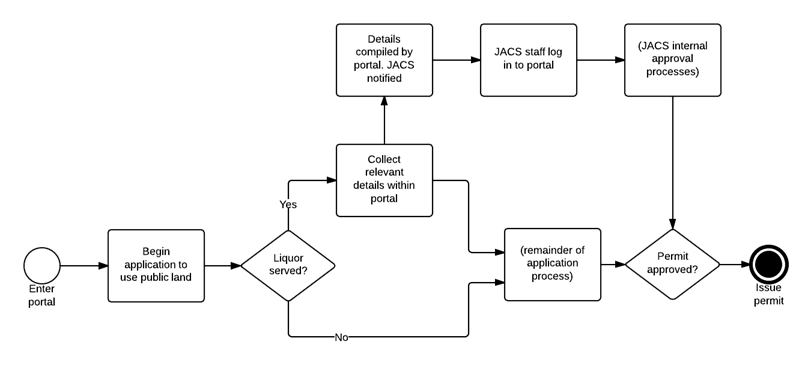
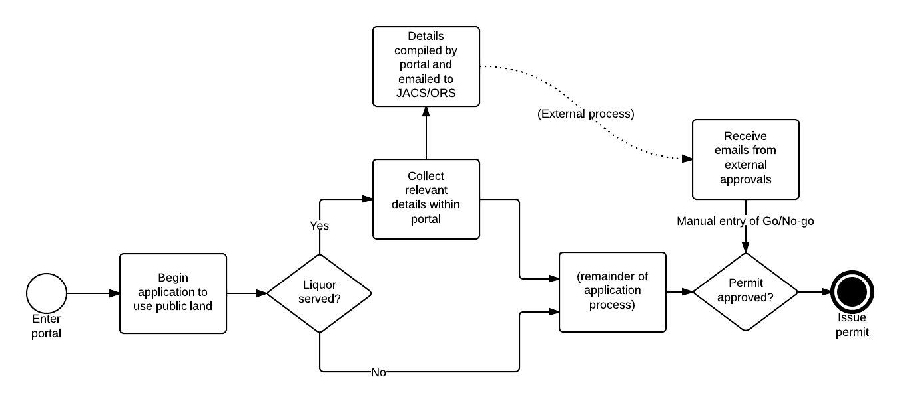
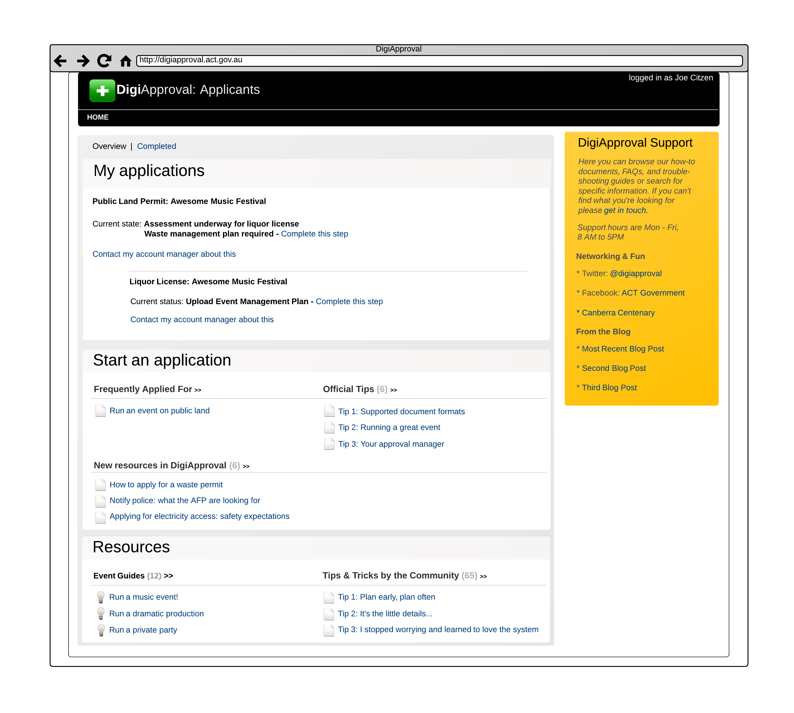
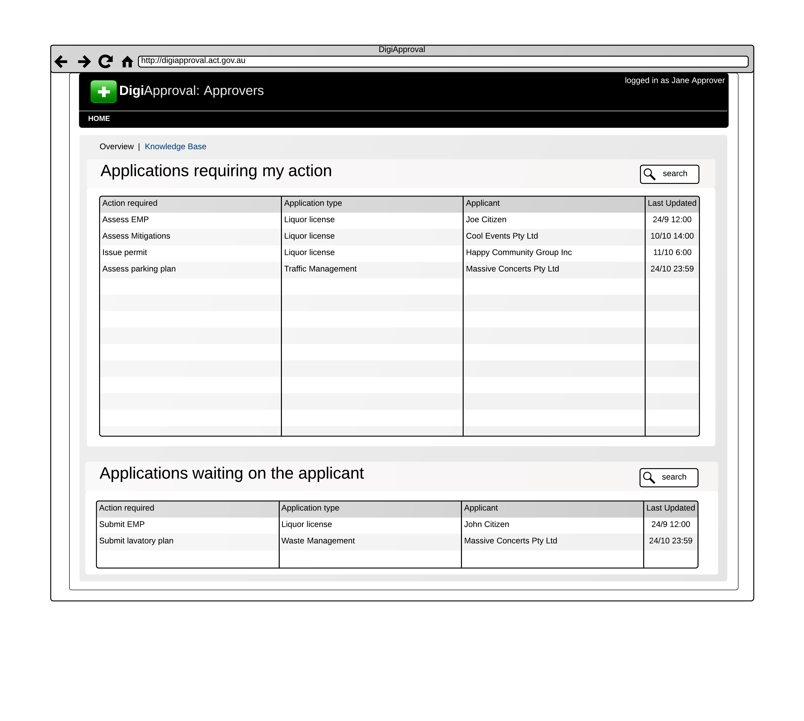
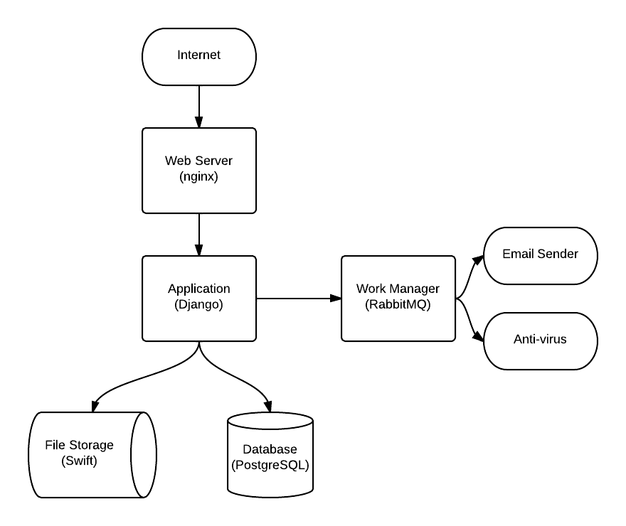

% Digital Canberra Challenge -- Project Design
% DigiACTive Pty Ltd (ABN 62 166 886 871)
% 15 January 2014

# Change Log
+ v 1 - Initial document
+ v 2 - Expanded document in response to feedback
    + References to NICTA changed to eGov Cluster
    + Changed all references to 'permits' to the more generic term 'approvals'
    + Rearranged and reworded project objectives
    + Added reference to PACS booking system project
    + Reworded and clarified description of user roles
    + Added section dealing with external stakeholders
    + Expand and clarify inter-agency interaction (s16)
    + Clarify that system is hosted and users require only a web browser to interact with it
    + Add organisational account option
    + Clarify and provide examples in some cases
    + Note requirements for pre-filling applications and traffic-light system for time
    + Minor typographical and grammatical changes
+ v 3 - Expanded and modified document in response to feedback
    + Changed all references to 'managers' to the more descriptive term 'delegators'
    + Added additional description of the workflow system
    + Added diagrams to explain 'in-the-system' and 'out-of-the-system' approval stages when dealing with multiple agencies

# Background #

The ACT Government controls large portions of land within the ACT as public unleased land, including many public parks and nature reserves that are regularly used for events. Holding an event on public unleased land generally requires approval. Parks and City Services handles approximately 2,500 applications per year, covering a wide range of events. Applications for large events can be highly complex, involving approval from four or five other government agencies and many pages of supporting documentation.

The current software used for handling land use approvals is basic and provides only rudimentary features for managing the approval process -- it does not provide an end-to-end system to manage applications from initial submission through to final approval. In particular, all communication with applicants and with other agencies/stakeholders is handled manually via email -- the officer handling the application must manually update the database when an applicant submits an updated document or another agency approves or rejects an application. This process is time-consuming and error-prone.

The process of scoping the project also revealed the following pain points that inform this project:

+ Approvals have to go through multiple agencies, which often fail to respond in a timely manner (if at all). The proliferation of contacts and lines of communication is difficult to manage.
+ It is unclear what approvals are needed to organise an event, leading to lots of unnecessary back-and-forth between the department and applicants.
+ Applicants are often unaware how long the process is likely to take, leading to disappointment when approvals are not ready in time.
+ Applicants are often unaware of the requirements of the different agencies, leading to lots of lengthy, time consuming and ultimately avoidable dialogs between parties.
+ Applicants are frustrated at how much work has to be done "from scratch" each time they organise an event.

# Objective #

The objective is two-fold:

+ To develop a proof of concept system to demonstrate a workflow-based, online system for use in the assessment and approval of open space for events.
+ To present a case study to the ACT Government and the eGov Cluster on the experience of the design and development.

# Outcomes #

+ To increase efficiency of government approval processes, especially multi-agency approvals
+ To improve the experience of those using the event approval system -- in particular, to make it more obvious what is required of applicants and when, what the state of their applications are, and where to go for resources or for help
+ To allow TAMS to make an informed decision on proceeding with further development of a new approvals system

# Outputs #

There are two main outputs:

+ A proof of concept system for online assessment and approval of open space for events.
+ A case study documenting DigiACTive and TAMS' experience of the development process.

# Scope of Work/Assumptions and Constraints #

The project has been scoped in the attached scope document, which also documents the assumptions and constraints.

# Governance and Reporting #

Per the project agreement, the project is guided by the Project Board.

The project board consists of:

+ **NICTA (eGov Cluster)**: Michael Phillips
+ **TAMS**: Rachel Reid
+ **DigiACTive**: Benjamin Roberts

Ongoing reporting occurs in the fortnightly project board meeting. The case study is a summative/conclusory report.

# Schedule #

The project has a soft deadline of 26 Feb 2014 (end of last task on the Gantt chart) and a hard deadline of 1 Mar 2014 (expiry of project agreement).

The project is scheduled by the Gantt chart produced by TAMS and stored on the eGovernment Cluster website.

# Budget #

The project budget is $5,000, which is available to DigiACTive for receipted expenses through the eGov Cluster.

# Stakeholders & Communication Strategy #

## Collaborative Agreement Parties ##

The Collaborative Agreement defines the interests and communication strategy for **DigiACTive**, **the eGov Cluster** and **TAMS**. 

## Community Parties ##

+ **MusicACT**
    + *Stakeholder interest*: MusicACT set the original challenge. Their interest is in the challenge POC being developed into a full system, thereby improving their experience in dealing with government whilst organising their events. They have identified a number of pain points which they would like to see improved. They see this project as part of a broader process of improving government services.
	+ *Communication strategy*: DigiACTive has consulted them in the scoping process and will also work with them in the user testing part of the process.
  
+ **Tuggeranong Community Festival**
    + *Stakeholder interest*: As the organisers of a large event in the territory they have an interest in the event organisation process being streamlined. They have highlighted a need for transparency and visibility regarding an applications processing status. They also identified a need for clarification of the relevant stakeholders requirements when issuing approvals.
    + *Communication strategy*: DigiACTive has consulted them in the scoping process and will also work with them in the user testing part of the process.
    
## Other Affected Parties ##

+ **SSICT**
    + *Stakeholder interest*: SSICT is responsible for the servers that the project would run on if the POC is converted to a full system. At this stage, none of the code is hosted on SSICT servers.
    + *Communication strategy*: SSICT's requirements are represented by their standards document. The solution is designed to comply with these standards. There is no ongoing communications planned with SSICT at this point.

+ **Other Agencies**:
    + *Stakeholder Interest*: The approval process involves several government agencies, including the **National Capital Authority**, the **Emergency Services Agency**, the **Australian Federal Police**, the **ACT Insurance Authority**, **Roads ACT**, **ACT Heritage**, **TAMS Urban Treescapes Branch** and the **Environment Protection Authority**. Each agency is responsible for ensuring that applications meet the relevant requirements within the agency's areas of interest. Each agency has its own policies, procedures and systems for handling applications. 
    + *Communication Strategy*: These agency's interests have been accounted for in the system design. Provision has been made for agencies to communicate effectively with TAMS staff and customers, whether they choose to adopt the system or remain with existing processes and systems (see the Technical Brief for more details). There is no ongoing communications planned with these agencies at this point.

# Risk Management #

At this stage, the output is a proof of concept leading to an outcome of informed decision making.

## Present Risks ##

The risks to the initial outcome are limited:

**Risks:**

+ **Unexpected difficulty of technical component leading to unsatisfactory POC**
    + *Likelihood*: Very likely to occur at various points throughout project.
    + *Severity*: Potentially severe.
    + *Evaluation*: Requires action. See below.

+ **Scope creep/change**
    + This has been effectively mitigated by the signed scope document, and requires no further action.

+ **Conflict in requirements/direction from stakeholders**
    + TAMS/community groups pushing in different directions due to different foci, pain points.
    + Ultimately this will be managed by the Project Board.

+ **DigiACTive team newness/inexperience leading to poor performance**
    + *Likelihood*: Moderate.
    + *Severity*: Potentially severe.
    + *Evaluation*: Managed through the Digital Canberra Challenge/Collaborative Agreement governance structure.

### Management Plan: unexpected technical difficulty ###
It is virtually inevitable in a technical project that some aspect will prove to be unexpectedly difficult.

A number of steps have been taken to reduce the likelihood of this becoming a show-stopping issue:

+ The scope has been managed and restricted. In particular several systems that are unnecessary and difficult/time-consuming for a POC have been put out of the scope.
+ The project has been designed around well known and widely used tools that have proven to be flexible and scalable: we know the tools are up to the task.

We also have a number of strategies to allow us to manage any issues that as they come up:

+ The nature of the POC allows us to "stub out" functionality, to show how it would look and work without actually implementing it. 

    For example, we have decided to "stub out" the payment system by assuming a transaction will succeed without completing further processing. This allows us to integrate payment steps into workflows, without spending our limited time implementing or integrating with a payment system.

+ Our regular meetings allow us to raise unexpected challenges, potentially finding novel ways around these problems that satisfy stakeholders' requirements in a way that is easier to implement.

+ Our links with the eGov Cluster, the innovation community in Canberra and with the ANU provide us with networks of experts that can help us resolve issues we may encounter.

Ultimately, this is an unavoidable risk that all software projects bear. We are confident that our mitigation strategies are sufficient.

### Management Plan: DigiACTive team ###
The DigiACTive team is new, and therefore has  the usual risks of new groups and companies.

The risks are largely mitigated by the structure of the Digital Canberra Challenge and the governance arrangements from the Collaborative Agreement.

+ The fortnightly meetings provide the *accountability* necessary to detect problems early.
+ The involvement of the eGov Cluster and their experience with early stage commercialisation provides the *resources* and *networks* for DigiACTive to seek help correcting problems as they arise.
+ The structure of the challenge provides a definite end point where the project can be abandoned if it has become unfeasible.

## Avoided Risks/Out of Scope risks ##
Risks will need to be reassessed should TAMS wish to proceed to a full system after the proof of concept. However, as it stands, the project poses low risk to TAMS:

+ **The output is a proof of concept that is not publicly accessible.** This closes off a large range of risks:
    + No confidential user data can be lost or stolen as no confidential user data will enter the system.
    + System malfunctions will not lead to embarrassment or public backlash as the system will not be open to the public.
    + System malfunctions will not lead to downtime or lost productivity internally as the system will not be used beyond a small group of testers at this stage.
   
+ TAMS is not committed to take the project further - if it is not fit for purpose or is going to be to expensive, TAMS can decide not to proceed with the project after the project agreement lapses on 1 March. TAMS is not obligated to progress the project beyond that point.
+ The DCC budget is for expense reimbursement only, and is capped at $5000. This is managed by the eGov Cluster.

# Related Projects #

The closest related work that DigiACTive is aware of is the existing smart-form system. There is also an ongoing project within PACS to develop a booking system for venue bookings.

Looking outside of PACS the other Digital Canberra Challenge project presently running, regarding the booking of drivers' license tests, is tangentially related in that it's a booking system, but targets a different use case and proceeds from a much simpler model -- there is no need for multi-agency involvement, for example.

## Future Extensions ##

The project scope is explicitly restricted to a proof of concept. Should the project proceed to a full system, there are a couple of related projects:

+ [Plan Your Picnic](http://planyourpicnic.org.au) has been identified as the basis for a possible "front end" to the booking system to allow users to discover the most appropriate land for their use case.
+ More generally, the scoping process identified the desire to build a portal of mostly static information about the available public spaces in the ACT.

# Guidelines & Standards #

While the project is being developed, the project will be built in line with the following guidelines and standards:

+ Industry best practise for security and confidentiality, including the use of:
    + Secure Sockets Layer
	+ Storage of passwords using salts and a password based key derivation function rather than a simple hashing function.
	+ Use of parameterised queries to avoid SQL injection attacks.
	+ Use of proven frameworks over "in house" or DIY technologies.
+ Correct and valid use of technologies such as HTML and CSS, such that all pages pass W3C validation.
+ SSICT standards, such that a full solution can be hosted on SSICT infrastructure with a minimum of intervention.

Before the POC can be deployed, future work will be required to bring it in line with the following other standards:

+ WCAG 2.0 compliance, so as the system meets legislative/human rights requirements for accessibility.
+ ACT Government branding/visual identity

The POC will be developed in such a way as to make that future work as simple as possible.

# Ongoing Quality Control #

Firstly, the outputs are a proof of concept, so an output is "fit for purpose" if it provides a realistic basis on which TAMS can evaluate the feasibility of converting the POC into a full system.

Given the limited duration of the project, there are two major opportunities to verify that the outputs are fit for purpose:

+ In the initial testing of a static workflow.
+ In the final evaluation of the POC for the Digital Canberra Challenge judging process.

In addition, the ongoing reporting provides a regular snapshot of progress and an opportunity to make sure the project stays on track.

There is no formal issue reporting system: emails will suffice. Should the project proceed to a full system, an proper issue/bug tracker will be reconsidered.

# Project Closure and Evaluation #

The initial project has a hard deadline of 1 March 2014, due to the nature of the Digital Canberra Challenge and the terms of the Project Agreement.

Prior to the deadline, DigiACTive will develop a case study documenting its experience.

Following the deadline, the following steps will be taken to close out the project.

+ eGov Cluster evaluates the Proof of Concept and Case Study document for the purposes of deciding a winner in the Digital Canberra Challenge competition.
+ TAMS undertakes an internal evaluation of the proof of concept, leading to a go/no-go decision about undertaking the full system.
+ DigiACTive reassesses its ongoing viability and team in light of TAMS' decision.

# Attachment: Scope Document #

\includepdf[pages=1-6,nup=1x2,frame=true,landscape=true]{attached_work_scope.pdf}

# Attachment: Technical Brief #

This technical brief updates and extends the original pitch outline available on the eGov Cluster shared folder.

## System Overview ##

The application will be a Web-based application, with both the applicant front-end and the agency back-end accessible using a standard Web browser, without any need for installing software on local computers. The applicant front-end will be accessible from the wider Internet, with the agency back-end accessible from approved ACT/Commonwealth Government networks.

## Who will use the system? ##

The DigiApproval system considers the following "characters":

 * An *applicant* is someone trying to organise an event or apply for an approval.
 * There are one or more *agencies* or *directorates*.
 * There may be *external stakeholders*.

### Applicants
Applications are lodged by individuals, unincorporated and incorporated associations and companies. In all cases, the application must be signed off on/lodged by a single person who is the point of contact for the application.

In all cases, applicants should have access to information they have previously submitted. In the case of organisations, this previously submitted information should be linked to the organisation, not to any individual within the organisation.

As such, an *applicant* may be either:

+ "Jane Citizen" - a Canberran making an application in her own name.
+ "Community Group Inc" - an organisation that runs multiple events. Within the organisation, a person must be nominated as the point of contact. This point of contact can be changed by the organisation as the leadership of the organisation changes.

(For the proof of concept stage, we will start with the private citizen, and extend it to groups if time permits.)

### Agencies

An *agency* is a body that an applicant must work with to get one or more of the approvals they require. In this POC, all applications are initially made to TAMS/PACS, which is an agency.
 
Within each agency, there are 3 roles:

* *Administrators* are responsible for overseeing the system and setting up the application process as *workflows* (detailed below).
* *Approvers* work with applicants to progress their applications, applying their professional judgment and agency policy to determine when and how applications proceed to the next stage of the workflow.
* *Delegators* are responsible for allocating applications to approvers and ensuring that workload is balanced appropriately among approvers. (Future extensions may automate parts of this role, but are not in scope for the POC.) It is expected, though not required, that a delegator would be a manager or experienced senior team member. An agency employee can be both an approver and a delegator at the same time.

#### Dealing with multiple agencies

As part of a single application process, an applicant may deal with agencies other than the agency which received the original application:

* Applicants may apply directly to other agencies for related types of approval. For example, an applicant applying  to use public land for a music festival may also apply for a liquor license.
* If an application triggers appropriate predefined rules, the system can automatically send relevant parts (sub-workflows) of the application to other agencies for feedback and approval.
* Approvers may manually send part of the application to other agencies or external stakeholders for feedback and approval. (This is appropriate where automated rules cannot be developed and professional judgement is necessary.)

Agencies may be either *in the system* or *out of the system*.

 * Agencies that are *in the system* have their own administrators, approvers and delegators -- they are handled entirely within the DigiApproval system.
 * Agencies that are *out of the system* have applications sent to them by email. Emails are sent through the DigiApproval web interface, and all emails are stored with the relevant application in a correspondence register.

The following diagrams outline the handling of multi-agency approvals.

This provides a way for the system to interoperate with agencies without them needing to take up the system internally.

When an applicant applies to another agency, the system should pre-fill appropriate data into their application so as to minimise the amount of work required by applicants.

### External stakeholders
External stakeholders (e.g. local businesses who may be affected by an event) are treated as if they are *out of the system* agencies.

## Workflows
Approval processes are represented as *workflows*. For each type of approval handled by the system, an administrator must define a *workflow specification*, detailing each *stage* of the process and the business rules which determine automatic *transitions* between stages. The transition rules ensure that the appropriate information is collected from the applicant, and the application is submitted for approval to the appropriate approving agencies.

### Stages

There are two main types of stage -- *data collection stages* and *approval stages*. Data collection stages appear to the applicant as a web form, asking questions similar to those found on existing application forms. Approval stages cause the application to appear in the agency delegator's worklist, which can then be assigned to an approver. Upon reviewing the previous data collection stages, the approver will mark the approval stage as "completed" when they are satisfied that the requirements are met, causing the workflow to transition to the next stage.

Stages can be executed in parallel, allowing agencies to begin assessing applications before the full application is submitted. For example, an organisation applies to hold an event requiring assessment by the ACT Insurance Authority (risk assessment plan and insurance paperwork) and Roads ACT (temporary traffic management plans), among other agencies. The applicant has completed the risk assessment and obtained their insurance paperwork, but has not yet completed their traffic management plan. The applicant can complete the "Risk Assessment/Insurance" data collection stage and proceed to the ACTIA approval stage immediately, then complete the "Traffic Management" data collection stage when they are ready. The workflow will be completed when there are no more outstanding stages remaining.

To facilitate parallel execution of stages, when multiple data collection stages are available to complete, the applicant will be given a menu allowing them to choose the next stage. When multiple approval stages are executing in parallel, the applicant will see the status of each approval stage.

### Transition Rules
Transition rules between stages define what happens after a stage is completed. Generally, the completion of one stage will trigger one or more subsequent stages. A simple transition rule may trigger the designated "next" stage in all circumstances, while a more complex transition rule may determine the appropriate stages to trigger based on the application of business rules (e.g. a large event with more than 100 attendees will trigger the "Risk Assessment/Insurance" stage to trigger, while small events will trigger a different stage).

## User Interface ##

Based on our pitch, we see the user interface unfolding as follows.

### Applicants

Before an applicant can begin a workflow, they must register as a user. 

Once they register with their name and contact details, they will be presented with a dashboard showing at a glance:

 * **Workflows that they can commence.** Once a workflow is commenced, the directorate is notified, and the application is assigned to an approver.
 * **Any existing applications that they have begun**, and the stage those applications are at. Applicants can pull up the details of their applications and see the entire history in one place. They can then make sure that they have completed any steps necessary for them to complete. The approver responsible for their application is notified whenever the applicant completes a step.
 * **A link to contact the approver assigned to help them progress their workflow**.
 * **A link to access previous completed applications**, should they need to re-download any documents/approvals, and to help them avoid duplicating effort if they arrange repeated events.

A very loose concept of what this might look like is below:

### Approvers

When an approver logs in, they can see at a glance:

* The applications for which they are responsible.
* The status of those applications:
    * Are they waiting on the applicant?
    * Are they waiting on another agency? Is that agency responding promptly, or have they taken too long?
    * Are they "in my court"?

Approvers can then pull up an application for which they are responsible, see, in one place:

+ The entire history of the application
+ All the communications that have been exchanged
+ How long the application has been pending, both internally, and with any other agencies involved. A "traffic light" style visualisation will be included.
+ Any steps necessary to progress it.

The applicant is notified whenever the approver completes a step, and approvers (and possibly applicants) are notified when an involved agency provides feedback.

A very loose concept of what this might look like is below. (This concept sketch doesn't include the multi-agency amendments, but that is in scope for the POC.)

### Delegators ###

A delegator will have a simple user interface to assign a workflow that has just commenced to an approver, and is able to re-allocate in-progress workflows if needed. (For example, if an approver is ill or leaves the directorate.)

Delegators will also be able to generate reports, as follows.

### Reporting ###
Based on stakeholder consultation, a reporting front-end has been added, that can generate reports on (at a minimum):

+ A calendar basis: for a day, what approvals have been granted?
+ A location basis: for a location, what approvals have been granted?
+ A "state" basis: how many approvals are pending? How many have been granted/rejected recently? By whom?

All reports can be generated by delegators and administrators. Some reports (calendar/location) can be generated by approvers so as they do not double-book events.

### Additional notes ###
+ In order for the pre-filling of related data to work, administrators must be able to tag questions in a way the system can understand (i.e. not just by the name of the question).
+ The system requires some way for administrators to define template emails for out of system agency emails, and have them filled in appropriately.

+ The system requires rules about what resets a time limit: for example sending documentation back to an applicant for more information.

## Technology Stack ##

Our solution can be decomposed into a web layer, an application layer, a set of asynchronous workers and a storage layer (file store and database).

 

Each of these layers is horizontally scalable.

The system will be implemented in [Django][django]. Django:

+ is a well known web framework for the Python programming language.
+ is used on sites that deal with millions of hits, so it is known to be able to scale.
+ has a large community of users. It will be easy to find Django developers capable of maintaining and extending the system.

The implementation focuses on scalability, security and portability to SSICT systems. It is being built around:

 * **Operating System**: CentOS
     * Largely equivalent to the RHEL environment prescribed by SSICT.
     * Furthermore, our stack should also port without issue to Solaris, as preferred by SSICT.
 * **Provisioning**: [Chef][chef], meeting the SSICT requirement for managed configuration over ad-hoc configuration.
 * **Web server**: [nginx][nginx], deploying SSL throughout.
 * **Application**: Django:
     * Python 3.3 in preference to 2.7.
     * A preference for using existing modules as opposed to developing our own functionality.
     * The workflow engine is [SpiffWorkflow][spiff].
 * **Worker layer**: [RabbitMQ][rabbitmq], interfaced through [Celery][celery].
    * Virus scanning workers will be implemented in [ClamAV][clamav], or possibly stubbed out if we run out of time.
    * Email workers will send mail through Amazon SES, using the SMTP interface for simple transition to SSICT infrastructure.
 * **Database**: [PostgreSQL][postgres].
     * Transition to an Oracle database to meet SSICT requirements should be straightforward thanks to Django's database abstraction. 
 * **File storage**: [OpenStack Swift][swift].
 * **Front end**: [Bootstrap][bootstrap] and [HTML5 boilerplate][h5bp]
     * Developed with an eye towards standards compliance, accessibility and extensibility.

We will be developing our system on Amazon Web Services (AWS), however, all the technologies have been chosen with a view to the code being hosted on SSICT servers should the prototype proceed to a full system.

### Security

Our system is designed to be able to solidly *authenticate* users, determine what those user are *authorised* to do, ensure the *integrity* of their actions and the system as a whole, while maintaining *confidentially* of applicant and directorate information, using industry best practices.

We will deploy SSL at the front end to ensure applicant passwords and information is encrypted while in transit. We will be implementing as much functionality as possible through standard libraries, reducing the scope for security flaws and error on our part. 

We will also be taking a proactive approach to security wherever possible. For example, a major source of security flaws arise from not verifying user input. Our system will make sure that we that user input is valid, make sure that uploaded documents are of the expected format and are free from known viruses, and so on, *before* they are presented to approvers.

[django]: http://django.org "Django"
[nginx]: http://nginx.org/en "nginx"
[rabbitmq]: http://rabbitmq.com "RabbitMQ"
[postgres]: http://postgresql.org "PostgreSQL"
[swift]: http://swift.openstack.org "OpenStack Swift"
[chef]: http://www.opscode.com/chef/ "Chef"
[celery]: http://www.celeryproject.org/ "Celery"
[clamav]: http://www.clamav.net/lang/en/ "Clam AntiVirus"
[spiff]: https://github.com/knipknap/SpiffWorkflow "SpiffWorkflow"
[bootstrap]: http://getbootstrap.com/ "Bootstrap"
[h5bp]: http://html5boilerplate.com/ "HTML5 Boilerplate"
